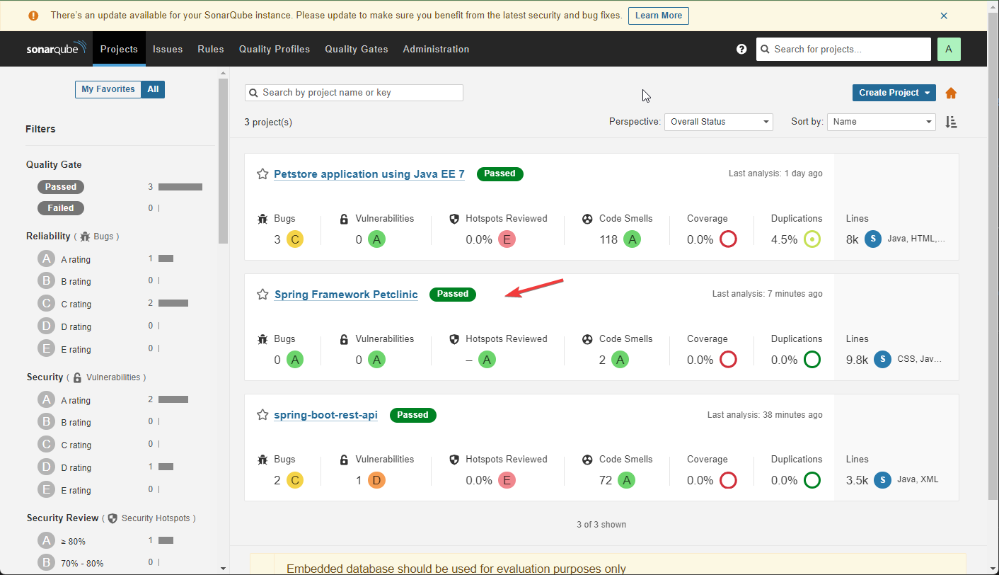
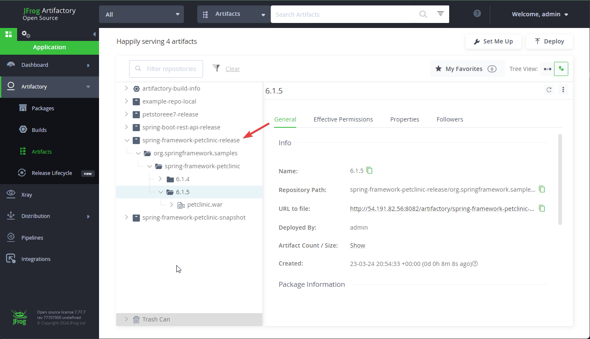

# App Monolitica CI Y CD
El pipeline se encuentra en el job __spring-framework-petclinic__

- __Build__
    - Se realiza el empaquetado en un file .war
- __Testing__
    - El informe de cobertura generado por Jacoco está disponible en http://54.191.82.56:8080/job/spring-framework-petclinic/lastBuild/jacoco/

- __Sonarqube__
    - Se analiza la calidad del código, cuyos resultados pueden consultarse http://54.191.82.56:9000/dashboard?id=org.springframework.samples%3Aspring-framework-petclinic
        

- __Artifactory__
    - Los artefactos están almacenados en un repositorio Jfrog, accesible a través de http://54.191.82.56:8082/ui/repos/tree/General/spring-framework-petclinic-release
        

- __Deploy Jobss (Ansible)__
    - La app monolito se despliega en la siguiente URL: 35.87.76.96:8080/petclinic    

__Nota:__ Los accesos para Sonar, Jenkins y Jfrog se encuentran detallados en el correo electrónico enviado previamente.
